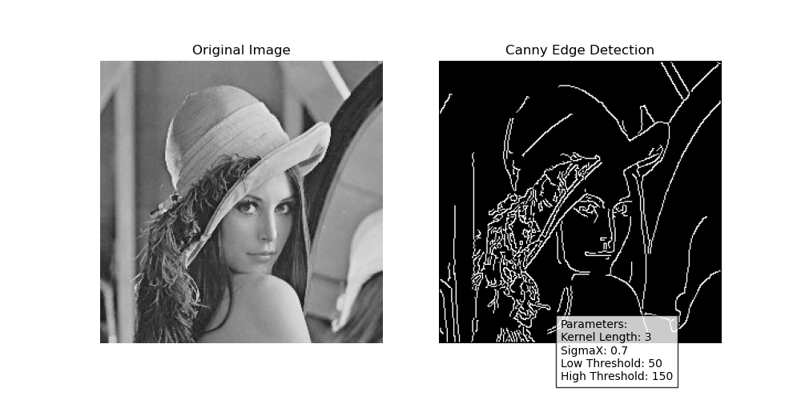

# Canny Edge Detection Implementation

This project implements the Canny edge detection algorithm using custom functions for Gaussian blur and Canny edge detection. The results are visualized using Matplotlib, including annotations of the parameters used.

---

## Project Structure

- **`GaussianFilter.py`**: Contains the `gaussian_blur` function for applying Gaussian blur to the input image.
- **`Canny.py`**: Contains the `canny_edge_detector` function for performing Canny edge detection.
- **`main.py`**: Main script to load the image, preprocess it, apply the Canny edge detection, and display the results.
- **`images/`**: Directory containing input images (e.g., `Lenna_gray.jpg`).
- **`Output/`**: Directory to save output results.

---

## Prerequisites

- Python 3.x
- Libraries:
  - `cv2` (OpenCV)
  - `numpy`
  - `matplotlib`
  - `scipy`

Install required libraries using:
```bash
pip install opencv-python numpy matplotlib scipy
```

---

## How to Run

1. Place your input image in the `images/` directory.
2. Update the `image_name` variable in `main.py` to the name of your input image (without the file extension).
3. Run the main script:
   ```bash
   python main.py
   ```
4. The output will be displayed and saved in the `Output/` directory with annotated parameters.

---

## Parameters

The following parameters are adjustable in `main.py`:

- `kernel_length`: Size of the Gaussian kernel (e.g., 3).
- `sigmaX`: Standard deviation for the Gaussian kernel (e.g., 0.7).
- `low_threshold`: Lower threshold for Canny edge detection (e.g., 50).
- `high_threshold`: Upper threshold for Canny edge detection (e.g., 150).

---

## Example Output

When processing the `Lenna_gray.jpg` image with the following parameters:

- Kernel Length: 3
- SigmaX: 0.7
- Low Threshold: 50
- High Threshold: 150

The result is saved as `Output/Lenna_gray/0.png` and looks like this:

**Original Image:**


**Canny Edge Detection Result:**



---

## Notes

- Ensure the `images/` and `Output/` directories exist before running the script.
- Modify the `main.py` script as needed to experiment with different images or parameter settings.

---

## License

This project is open-source and available under the [MIT License](LICENSE).
